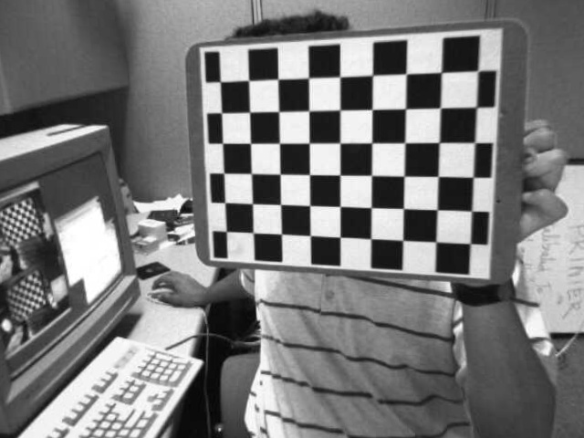
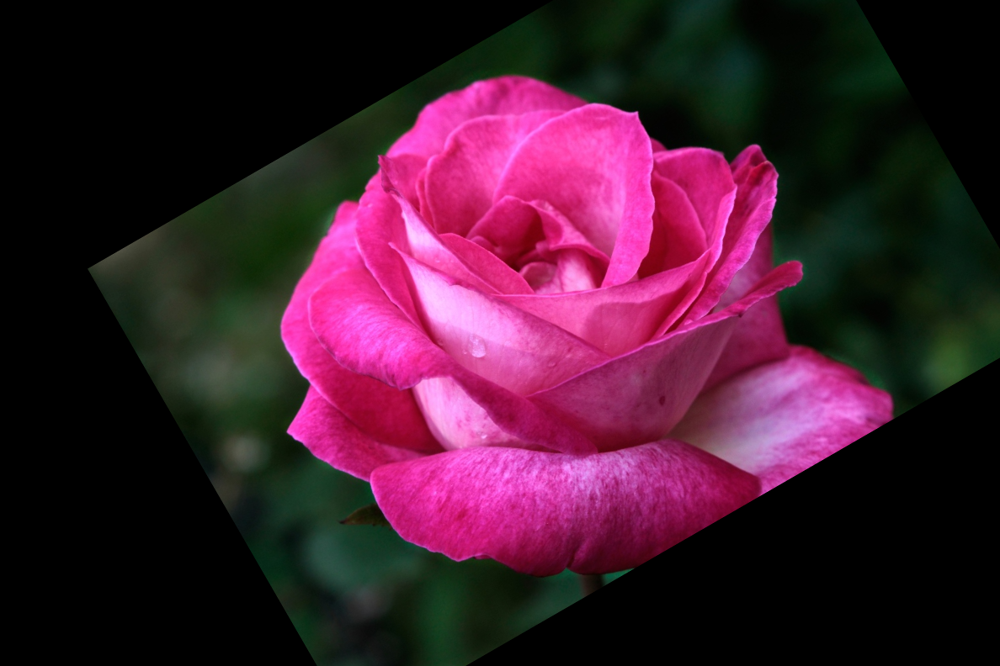
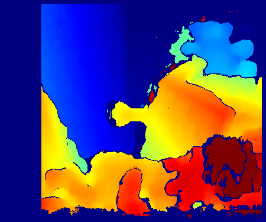

# 컴퓨터 비전 OpenCV 실습 (01–03)

컴퓨터 비전 수업의 이미지 생성 및 카메라 파라미터 분석 실습 과제 저장소입니다.  
총 3개의 실습으로 구성되어 있으며, 카메라 캘리브레이션, 기하학적 변환, 스테레오 깊이 추정을 다룹니다.

---

## 환경 설정

| 항목 | 버전/도구 |
|---|---|
| Python | 3.10+ |
| 주요 라이브러리 | `opencv-python`, `numpy` |

```bash
# 필요한 패키지 설치
pip install opencv-python numpy
```

## 실행 방법

프로젝트 루트(`computer_vison/2/`)에서 실행:

```bash
python 01.Calibration.py
python 02.Rotation.py
python 03.Depth.py
```

---

## 실습 01 — Camera Calibration (카메라 캘리브레이션)

### 과제 설명

체크보드 패턴 이미지를 활용하여 카메라의 내부 파라미터와 왜곡 계수를 산출하고, 이를 통해 렌즈 왜곡을 보정하는 실습이다.

- `cv2.findChessboardCorners()`를 사용하여 체크보드 코너 검출
- `cv2.calibrateCamera()`로 카메라 행렬(K) 및 왜곡 계수(dist) 계산
- `cv2.getOptimalNewCameraMatrix()`로 보정된 카메라 매트릭스 산출
- `cv2.undistort()`를 적용하여 최종 왜곡 보정 이미지 생성

### 핵심 코드 설명

```python
# 카메라 매트릭스 및 왜곡 계수 산출
ret, K, dist, rvecs, tvecs = cv2.calibrateCamera(objpoints, imgpoints, img_size, None, None)

# 최적의 카메라 매트릭스 계산 (alpha=1로 설정하여 픽셀 보존)
newcameramtx, roi = cv2.getOptimalNewCameraMatrix(K, dist, (w, h), 1, (w, h))

# 왜곡 보정 적용
undistorted_img = cv2.undistort(test_img, K, dist, None, newcameramtx)
```

> **포인트**: `calibrateCamera`는 3D 실제 좌표와 2D 이미지 좌표의 쌍을 이용해 투영 모델의 파라미터를 추정한다. `alpha=1` 설정은 왜곡 보정 시 발생하는 손실을 최소화하여 원본 픽셀을 모두 유지한다.

### 전체 코드

```python
import cv2 
import numpy as np 
import glob 
import os 

# -----------------------------
# 0. 설정 및 변수 초기화
# -----------------------------
# 체크보드의 내부 코너 개수 설정 (가로 교차점 9개, 세로 교차점 6개)
CHECKERBOARD = (9, 6)

# 체크보드 한 칸의 실제 물리적 크기 설정 (단위: mm)
square_size = 25.0

# 서브픽셀(SubPixel) 정밀도를 높이기 위한 반복 알고리즘 종료 조건 설정
# (알고리즘이 오차 0.001 이하에 도달하거나, 최대 30번 반복하면 정밀 탐색을 종료함)
criteria = (cv2.TERM_CRITERIA_EPS + cv2.TERM_CRITERIA_MAX_ITER, 30, 0.001)

# 3D 실제 세계 좌표계(World coordinates)를 저장할 빈 Numpy 배열 생성
# 평면이므로 Z축은 0으로 가정하며, 크기는 (총 코너 개수 54개, x/y/z 3차원)인 배열 생성
objp = np.zeros((CHECKERBOARD[0]*CHECKERBOARD[1], 3), np.float32)

# np.mgrid를 사용하여 (0,0), (1,0) ... 형태의 2D 격자 좌표를 생성한 뒤, 배열의 X, Y 열 위치에 할당
objp[:, :2] = np.mgrid[0:CHECKERBOARD[0], 0:CHECKERBOARD[1]].T.reshape(-1, 2)

# 생성된 기본 격자 좌표에 실제 체크보드 한 칸의 크기(25.0mm)를 곱하여 실제 물리적 거리 스케일 반영
objp *= square_size

# 모든 이미지에서 성공적으로 찾은 3D 실제 좌표(objp) 배열들을 모아둘 빈 리스트
objpoints = []
# 모든 이미지에서 성공적으로 찾은 2D 이미지 픽셀 좌표들을 모아둘 빈 리스트
imgpoints = []

# 현재 파이썬 스크립트가 실행되고 있는 작업 디렉토리 경로를 터미널에 출력
print("▶ 현재 실행 디렉토리:", os.getcwd())

# 찾고자 하는 캘리브레이션용 이미지 파일들의 경로 및 패턴 지정 (left01.jpg, left02.jpg 등)
search_path = "images/calibration_images/left*.jpg"

# glob을 사용하여 지정된 패턴에 맞는 모든 이미지 파일의 경로를 리스트 형태로 가져옴
images = glob.glob(search_path)

# 검색된 이미지 파일의 총 개수와 해당 경로 패턴을 화면에 출력하여 확인
print(f"▶ 찾은 이미지 개수: {len(images)}장 (경로: {search_path})\n")

# 입력 이미지의 해상도(가로, 세로 픽셀 크기)를 저장할 변수 초기화 (캘리브레이션 함수 호출 시 필요함)
img_size = None
# 코너 검출에 성공한 이미지의 개수를 카운트하기 위한 변수를 0으로 초기화
success_count = 0

# -----------------------------
# 1. 체크보드 코너 검출
# -----------------------------
# 찾은 이미지 파일 경로 리스트를 순회하며 하나씩 처리하는 반복문 시작
for fname in images:
    # OpenCV를 사용하여 파일 경로(fname)로부터 이미지를 읽어와 img 변수에 할당
    img = cv2.imread(fname)

    # 이미지를 정상적으로 읽어오지 못한 경우(파일이 깨졌거나 경로 오류 등) 예외 처리
    if img is None:
        # 에러 메시지 출력
        print(f"이미지 읽기 에러: {fname}")
        # 아래 코드를 무시하고 다음 이미지 파일로 넘어감
        continue

    # 코너 검출 알고리즘은 흑백 이미지에서 수행해야 하므로, 원본 컬러 이미지(BGR)를 흑백(Grayscale)으로 변환
    gray = cv2.cvtColor(img, cv2.COLOR_BGR2GRAY)

    # 이미지 크기(img_size)가 아직 설정되지 않았다면 (첫 번째 유효 이미지를 처리할 때 1회만 실행됨)
    if img_size is None:
        # 흑백 이미지의 shape(세로, 가로) 차원을 뒤집어서 (가로, 세로) 튜플 형태로 img_size에 저장
        img_size = gray.shape[::-1]

    # 흑백 이미지에서 체크보드의 내부 코너 위치를 찾는 함수 호출
    # (ret: 검출 성공 여부 boolean, corners: 찾은 2D 코너 픽셀 좌표 배열 반환)
    ret, corners = cv2.findChessboardCorners(gray, CHECKERBOARD, None)

    # 체크보드 코너를 모두 성공적으로 찾은 경우
    if ret == True:
        # 3D 공간 상의 정해진 실제 좌표 배열(objp)을 objpoints 리스트에 추가 (2D 픽셀 좌표와 쌍을 맞추기 위함)
        objpoints.append(objp)

        # 찾은 코너 좌표의 정밀도를 픽셀 이하(SubPixel) 단위로 미세하게 조정하여 캘리브레이션 정확도를 높임
        corners2 = cv2.cornerSubPix(gray, corners, (11, 11), (-1, -1), criteria)

        # 정밀화된 2D 이미지 좌표를 imgpoints 리스트에 추가
        imgpoints.append(corners2)

        # 성공적으로 코너를 찾았으므로 성공 카운트를 1 증가
        success_count += 1

        # 어떤 파일이 성공했는지 화면에 출력
        print(f"⭕ 성공: {fname}")
        
    # 코너를 찾지 못한 경우 (이미지가 잘렸거나, 조명이 나쁘거나, 체크보드 크기 설정이 틀린 경우)
    else:
        # 실패한 파일 이름을 화면에 출력하여 사용자에게 알림
        print(f"❌ 실패 (코너 못 찾음): {fname}")

# 전체 이미지 검출 반복문을 마친 후, 최종적으로 코너를 찾아낸 유효 이미지의 총 개수를 출력
print(f"\n▶ 최종적으로 코너 검출에 성공한 유효 이미지: {success_count}장")

# -----------------------------
# 2. 카메라 캘리브레이션 및 검증
# -----------------------------
# 코너 검출에 성공한 이미지가 단 한 장도 없는 경우, 캘리브레이션을 진행할 수 없으므로 에러 처리
if success_count == 0:
    # 에러 분석 헤더 출력
    print("\n[🚨 치명적 에러 분석 🚨]")
    
    # 이미지 파일 자체를 폴더에서 찾지 못한 경우
    if len(images) == 0:
        print("원인: 이미지를 한 장도 찾지 못했습니다.")
        print("해결책: 폴더 이름이 오타가 없는지, 바탕화면의 computer_vison/2 폴더 안에 images 폴더가 정확히 있는지 확인하세요.")
        
    # 이미지는 찾았으나 코너 검출에서 전부 실패한 경우 (보통 CHECKERBOARD 크기 오입력)
    else:
        print("원인: 이미지는 찾았지만 코너 검출에 100% 실패했습니다.")
        print("해결책: left01.jpg 사진을 열어보고 내부 코너(검은색과 흰색이 교차하는 십자가 지점) 개수를 직접 세어보세요.")
        print("가로 교차점 개수와 세로 교차점 개수를 세어서 코드 10번째 줄의 CHECKERBOARD = (가로, 세로) 로 수정해야 합니다.")

# 코너 검출에 성공한 이미지가 1장 이상이어서 정상적으로 캘리브레이션이 가능한 경우
else:
    # 캘리브레이션 연산 시작 알림 출력
    print("\n▶ 캘리브레이션 연산을 시작합니다...")

    # 모아둔 3D 대응 좌표(objpoints)와 2D 픽셀 좌표(imgpoints)를 이용해 카메라 내부 파라미터와 왜곡 계수를 계산
    # 반환값: ret(재투영 오차), K(내부 파라미터 3x3 행렬), dist(왜곡 계수 1x5 배열), rvecs(회전 벡터), tvecs(이동 벡터)
    ret, K, dist, rvecs, tvecs = cv2.calibrateCamera(objpoints, imgpoints, img_size, None, None)

    # 계산된 카메라 내부 파라미터 행렬(Camera Matrix K) 출력 알림
    print("\nCamera Matrix K:")
    # 실제 K 행렬 값 출력 (초점 거리 fx, fy 및 주점 px, py 포함)
    print(K)

    # 계산된 렌즈 왜곡 계수(Distortion Coefficients) 출력 알림
    print("\nDistortion Coefficients:")
    # 실제 dist 값 출력 (방사 왜곡 k1, k2, k3 및 접선 왜곡 p1, p2 포함)
    print(dist)
    
    # 결과 이미지를 저장할 'outputs' 폴더가 없을 경우, 에러를 방지하기 위해 자동으로 폴더 생성
    os.makedirs("outputs", exist_ok=True)
    
    # 계산된 파라미터가 잘 작동하는지 첫 번째 유효 이미지를 불러와서 보정 테스트 진행
    test_img = cv2.imread(images[0])

    h, w = test_img.shape[:2]
    
    # cv2.getOptimalNewCameraMatrix의 alpha 값을 1로 설정하여 잘려나가는 픽셀 없이 모두 보존
    # (이로 인해 가장자리에 까맣게 휘어진 여백이 생기며, 이것이 과제 예시와 동일한 형태입니다)
    newcameramtx, roi = cv2.getOptimalNewCameraMatrix(K, dist, (w, h), 1, (w, h))
    
    # cv2.undistort 함수를 사용하여 렌즈 왜곡이 있는 원본 이미지(test_img)를 평평하게 펴주는 보정 연산 수행
    undistorted_img = cv2.undistort(test_img, K, dist, None, newcameramtx)
    
    # 왜곡이 보정된 최종 결과 이미지를 'outputs' 폴더 안에 'undistorted_test.jpg'라는 이름으로 저장
    cv2.imwrite("outputs/undistorted_test.jpg", undistorted_img)
    
    # 테스트 이미지가 성공적으로 저장되었음을 터미널에 출력하여 프로그램 정상 종료 알림
    print("\n▶ 완료: 왜곡 보정 테스트 이미지가 'outputs/undistorted_test.jpg'로 저장되었습니다.")
```

### 최종 결과물



---

## 실습 02 — Image Transformation (이미지 변환)

### 과제 설명

이미지를 회전, 크기 조절, 그리고 평행 이동을 포함한 아핀 변환(Affine Transform)을 수행하는 실습이다.

- `cv2.getRotationMatrix2D()`로 회전 및 스케일 행렬 생성
- 행렬의 3열 값 수정을 통해 평행 이동 연산 결합
- `cv2.warpAffine()`을 사용하여 최종 변환된 이미지 도출

### 핵심 코드 설명

```python
# 회전 중심, 각도(30도), 스케일(0.8) 설정하여 변환 행렬 생성
M = cv2.getRotationMatrix2D(center, 30, 0.8)

# 평행 이동량 추가 (x축 +80, y축 -40)
M[0, 2] += 80  
M[1, 2] -= 40  

# 아핀 변환 적용
transformed_img = cv2.warpAffine(img, M, (w, h))
```

> **포인트**: OpenCV의 아핀 행렬은 동차 좌표계 개념을 바탕으로 한다. 행렬의 마지막 열에 해당하는 $t_x, t_y$ 값을 조절함으로써 별도의 연산 없이 이동 변환을 한꺼번에 처리할 수 있다.

### 전체 코드

```python
import cv2 
import numpy as np
import os

# -----------------------------
# 1. 이미지 로드 및 기본 정보 추출
# -----------------------------
# cv2.imread를 사용하여 상대 경로에 있는 원본 이미지(rose.png)를 읽어와 BGR 컬러 포맷의 Numpy 배열로 저장
img = cv2.imread("images/rose.png")

# 파일 경로가 틀렸거나 파일이 존재하지 않아 이미지를 불러오지 못한 경우 예외 발생 (에러 방지용)
if img is None:
    # 프로그램 실행을 중단하고 원인을 명확히 알리는 에러 메시지 출력
    raise FileNotFoundError("images/rose.png 파일을 찾을 수 없습니다. 경로를 다시 확인해주세요.")

# 원본 이미지 배열의 shape 속성에서 높이(세로 픽셀 수, h)와 너비(가로 픽셀 수, w) 값을 추출
h, w = img.shape[:2]

# 이미지의 정중앙 좌표를 계산하여 튜플 형태로 저장 (w // 2, h // 2). 
# 회전 변환을 수행할 때 기준이 될 앵커 포인트(Anchor point)로 사용됨
center = (w // 2, h // 2)

# -----------------------------
# 2. 회전 및 스케일 변환 행렬 생성
# -----------------------------
# cv2.getRotationMatrix2D 함수는 유사 변환(Similarity Transform)을 위한 2x3 아핀 변환 행렬(M)을 반환함
# 파라미터 1: 회전의 중심점 (앞서 구한 이미지의 정중앙)
# 파라미터 2: 회전 각도 (30도). OpenCV에서는 양수(+) 값이 반시계 방향(Counter-clockwise) 회전을 의미함
# 파라미터 3: 스케일 팩터 (0.8). 이미지의 크기를 80%로 축소함
M = cv2.getRotationMatrix2D(center, 30, 0.8)

# -----------------------------
# 3. 평행 이동 결합 (Translation)
# -----------------------------
# 생성된 2x3 행렬 M은 [[a11, a12, tx], [a21, a22, ty]] 형태의 구조를 가짐
# 여기서 3번째 열의 값들(tx, ty)이 동차 좌표계(Homogeneous coordinates) 관점에서 평행 이동을 담당함

# M[0, 2]는 X축(가로) 이동량 tx를 의미. 기존 값에 +80을 더하여 오른쪽으로 80px 이동하도록 수정
M[0, 2] += 80  
# M[1, 2]는 Y축(세로) 이동량 ty를 의미. 기존 값에 -40을 더하여 위쪽으로 40px 이동하도록 수정
# (OpenCV 이미지 좌표계는 왼쪽 위가 (0,0)이고 아래로 갈수록 Y값이 증가하므로, 음수는 위쪽 방향을 의미함)
M[1, 2] -= 40  

# -----------------------------
# 4. Affine Transform (아핀 변환) 적용
# -----------------------------
# cv2.warpAffine 함수를 사용하여 위에서 완성한 2x3 아핀 변환 행렬 M을 원본 이미지에 최종 적용
# 원본 이미지의 모든 픽셀 좌표 (x, y)가 M 행렬과 연산되어 새로운 좌표 (x', y')로 이동됨 (평행성 유지)
# 세 번째 파라미터 (w, h)는 출력될 결과 이미지의 해상도(크기)를 원본과 동일하게 유지하겠다는 의미임
# (변환 후 이미지 범위를 벗어나는 빈 공간은 OpenCV 기본값인 검은색 픽셀로 자동 채워짐)
transformed_img = cv2.warpAffine(img, M, (w, h))

# -----------------------------
# 5. 결과 저장 및 출력
# -----------------------------
# 결과를 저장할 'outputs' 폴더가 현재 디렉토리에 없다면 자동으로 생성 (에러 방지용)
os.makedirs("outputs", exist_ok=True)

# 변환이 완료된 이미지 배열(transformed_img)을 지정된 경로에 PNG 파일 형태로 저장
cv2.imwrite("outputs/transformed_rose.png", transformed_img)

# 프로그램이 정상적으로 연산과 저장을 마쳤음을 터미널에 출력하여 사용자에게 알림
print("▶ 완료: 회전, 축소, 이동이 적용된 이미지가 'outputs/transformed_rose.png'로 저장되었습니다.")
```

### 최종 결과물



---

## 실습 03 — Stereo Camera & Depth (스테레오 비전 및 깊이 추정)

### 과제 설명

두 대의 카메라 이미지를 사용하여 시차를 계산하고, 물체까지의 실제 깊이를 도출하는 실습이다.

- `cv2.StereoBM_create()`로 시차 계산 엔진 설정
- $Z = (f \times B) / d$ 공식을 활용한 거리 연산
- 특정 ROI 영역에 대한 평균 시차/거리 추출 및 원근 관계 해석

### 핵심 코드 설명

```python
# 시차(Disparity) 계산
stereo = cv2.StereoBM_create(numDisparities=64, blockSize=15)
disparity = stereo.compute(gray_left, gray_right).astype(np.float32) / 16.0

# 깊이(Depth, Z) 계산 공식 적용
depth_map[valid_mask] = (f * B) / disparity[valid_mask]
```

> **포인트**: 시차($d$)와 실제 거리($Z$)는 반비례 관계에 있다. 카메라 외부 파라미터인 베이스라인($B$)과 내부 파라미터인 초점 거리($f$)를 알면 투영 모델을 통해 3차원 깊이 정보를 복원할 수 있다.

### 전체 코드

```python
import cv2 
import numpy as np 
from pathlib import Path 

# -----------------------------
# 0. 설정 및 데이터 로드
# -----------------------------
# 결과를 저장할 'outputs' 폴더 경로를 Path 객체로 지정
output_dir = Path("./outputs")
# 폴더가 존재하지 않으면 부모 디렉토리까지 포함하여 자동으로 생성 (exist_ok=True로 이미 있어도 에러 무시)
output_dir.mkdir(parents=True, exist_ok=True)

# OpenCV를 사용하여 왼쪽, 오른쪽 카메라에서 각각 촬영된 컬러 스테레오 이미지를 불러옴
left_color = cv2.imread("images/left.png")
right_color = cv2.imread("images/right.png")

# 경로 오류나 파일 누락으로 이미지를 정상적으로 불러오지 못한 경우 에러 발생
if left_color is None or right_color is None:
    raise FileNotFoundError("좌/우 이미지를 찾지 못했습니다. 'images' 폴더 내 파일명과 확장자(.png)를 확인하세요.")

# 카메라 캘리브레이션을 통해 미리 얻어진 내부/외부 파라미터 값 설정
f = 700.0 # 카메라의 초점 거리 (Focal length), 단위: 픽셀
B = 0.12 # 두 카메라 렌즈 중심 사이의 물리적 거리인 베이스라인 (Baseline), 단위: 미터(m)

# 깊이(Depth)를 분석하고 비교할 세 가지 특정 물체의 관심 영역(ROI, Region of Interest) 좌표 설정
# 포맷: "물체이름": (시작 x좌표, 시작 y좌표, 가로 너비 w, 세로 높이 h)
rois = {
    "Painting": (55, 50, 130, 110),
    "Frog": (90, 265, 230, 95),
    "Teddy": (310, 35, 115, 90)
}

# StereoBM(Block Matching) 알고리즘은 흑백 이미지에서 픽셀 밝기 패턴을 비교하므로 BGR 컬러를 Grayscale로 변환
gray_left = cv2.cvtColor(left_color, cv2.COLOR_BGR2GRAY)
gray_right = cv2.cvtColor(right_color, cv2.COLOR_BGR2GRAY)

# -----------------------------
# 1. Disparity(시차) 계산
# -----------------------------
# OpenCV의 Block Matching 스테레오 객체 생성
# numDisparities: 탐색할 최대 시차 범위 (반드시 16의 배수여야 함, 여기서는 64 픽셀까지 탐색)
# blockSize: 매칭에 사용할 픽셀 블록의 크기 (홀수여야 하며, 여기서는 15x15 윈도우 사용)
stereo = cv2.StereoBM_create(numDisparities=64, blockSize=15)

# 왼쪽 이미지와 오른쪽 이미지를 비교하여 각 픽셀이 얼만큼 가로로 이동했는지(Disparity) 계산
disparity_16 = stereo.compute(gray_left, gray_right)

# OpenCV의 compute 함수 결과는 내부 메모리 효율을 위해 실제 시차 값에 16이 곱해진 16비트 정수형(int16)으로 반환됨
# 따라서 정확한 픽셀 단위 시차를 얻으려면 실수형(float32)으로 변환 후 16.0으로 나누어 정규화해야 함
disparity = disparity_16.astype(np.float32) / 16.0

# -----------------------------
# 2. Depth(깊이) 계산
# 공식: Z = (f * B) / d
# -----------------------------
# 계산된 Depth 값을 저장할 빈(0으로 채워진) 배열을 disparity와 동일한 크기와 타입(float32)으로 생성
depth_map = np.zeros_like(disparity, dtype=np.float32)

# 시차(disparity)가 0 이하인 경우는 매칭에 실패했거나 물체가 너무 멀리 있어 거리가 무한대(Z=∞)인 노이즈 픽셀임
# ZeroDivisionError(0으로 나누기 에러)를 방지하기 위해 0보다 큰 유효한 픽셀 위치만 True로 가지는 마스크 생성
valid_mask = disparity > 0

# 유효한 픽셀 위치(valid_mask가 True인 곳)에만 Z = (f * B) / d 공식을 적용하여 실제 미터(m) 단위 깊이 도출
depth_map[valid_mask] = (f * B) / disparity[valid_mask]

# -----------------------------
# 3. ROI별 평균 disparity / depth 계산
# -----------------------------
# 각 물체별 계산 결과를 저장할 딕셔너리 초기화
results = {}

# 설정해둔 3개의 관심 영역(ROI)을 순회하며 데이터 추출
for name, (x, y, w, h) in rois.items():
    # 전체 disparity 맵과 depth 맵에서 해당 물체의 사각형 영역(y~y+h, x~x+w)만 Numpy 슬라이싱으로 잘라냄
    roi_disp = disparity[y:y+h, x:x+w]
    roi_depth = depth_map[y:y+h, x:x+w]
    
    # 해당 영역 내에서 에러 없이 정상적으로 계산된 픽셀 마스크 추출
    roi_valid = valid_mask[y:y+h, x:x+w]
    
    # ROI 내에 유효한(계산된) 픽셀이 하나라도 존재하는 경우
    if np.any(roi_valid):
        # 유효한 픽셀들만의 disparity 평균값과 depth 평균값을 np.mean으로 계산
        mean_disp = np.mean(roi_disp[roi_valid])
        mean_depth = np.mean(roi_depth[roi_valid])
    else:
        # 매칭이 전혀 안 된 영역일 경우 평균값을 0.0으로 예외 처리
        mean_disp = 0.0
        mean_depth = 0.0
        
    # 물체 이름(name)을 키(key)로 하여 계산된 평균값 저장
    results[name] = {"disparity": mean_disp, "depth": mean_depth}

# -----------------------------
# 4. 결과 출력 및 해석
# -----------------------------
print("=== ROI 별 평균 Disparity 및 Depth ===")
# 딕셔너리에 저장된 결과물(물체별 시차 및 깊이)을 보기 좋게 포맷팅하여 출력 (소수점 제한)
for name, vals in results.items():
    print(f"- {name}: Disparity = {vals['disparity']:.2f} px, Depth = {vals['depth']:.3f} m")

# 물체 중 평균 Disparity 값이 가장 큰(즉, 카메라 렌즈에 가장 가까운) 물체의 이름을 찾음
closest_obj = max(results, key=lambda k: results[k]['disparity'])
# 물체 중 평균 Disparity 값이 가장 작은(즉, 카메라 렌즈에서 가장 멀리 있는) 물체의 이름을 찾음
farthest_obj = min(results, key=lambda k: results[k]['disparity'])

# 시차와 깊이의 반비례 관계를 바탕으로 최종 결론 출력
print(f"\n[해석 결론]")
print(f"Disparity가 가장 큰(Depth가 가장 작은) {closest_obj}가 카메라에서 가장 가깝습니다.")
print(f"Disparity가 가장 작은(Depth가 가장 큰) {farthest_obj}가 카메라에서 가장 멉니다.")

# -----------------------------
# 5. 시각화를 위한 정규화 및 저장 (제공된 스켈레톤 코드 기반)
# -----------------------------
# 원본 시차 데이터를 손상시키지 않기 위해 복사본 생성
disp_tmp = disparity.copy()
# 0 이하의 비정상 값은 계산에서 제외하기 위해 NaN(Not a Number) 처리
disp_tmp[disp_tmp <= 0] = np.nan

# 모든 값이 NaN일 경우 시각화가 불가능하므로 에러 발생
if np.all(np.isnan(disp_tmp)):
    raise ValueError("유효한 disparity 값이 없습니다.")

# 극단적인 노이즈를 제외하기 위해 하위 5%와 상위 95%의 값을 최소/최대 기준으로 설정
d_min = np.nanpercentile(disp_tmp, 5)
d_max = np.nanpercentile(disp_tmp, 95)

# 분모가 0이 되는 것을 방지
if d_max <= d_min:
    d_max = d_min + 1e-6

# Min-Max 정규화를 통해 값을 0.0 ~ 1.0 사이의 비율로 변환
disp_scaled = (disp_tmp - d_min) / (d_max - d_min)
disp_scaled = np.clip(disp_scaled, 0, 1)

# 화면 출력을 위해 8비트(0~255) 배열 구조 생성
disp_vis = np.zeros_like(disparity, dtype=np.uint8)
valid_disp = ~np.isnan(disp_tmp)
# 정규화된 비율 데이터에 255를 곱해 최종 픽셀 밝기값 매핑
disp_vis[valid_disp] = (disp_scaled[valid_disp] * 255).astype(np.uint8)

# 흑백 이미지를 온도 분포 형태의 컬러맵(COLORMAP_JET: 빨간색일수록 높은 값)으로 변환
disparity_color = cv2.applyColorMap(disp_vis, cv2.COLORMAP_JET)

# 깊이(Depth) 맵도 동일한 방식으로 정규화 및 시각화 준비
depth_vis = np.zeros_like(depth_map, dtype=np.uint8)

if np.any(valid_mask):
    depth_valid = depth_map[valid_mask]
    z_min = np.percentile(depth_valid, 5)
    z_max = np.percentile(depth_valid, 95)

    if z_max <= z_min:
        z_max = z_min + 1e-6

    depth_scaled = (depth_map - z_min) / (z_max - z_min)
    depth_scaled = np.clip(depth_scaled, 0, 1)
    
    # 깊이 맵은 시차 맵과 반대로 거리가 멀수록(값이 클수록) 어둡게 보이도록 반전(Invert)
    depth_scaled = 1.0 - depth_scaled
    depth_vis[valid_mask] = (depth_scaled[valid_mask] * 255).astype(np.uint8)

# 반전된 깊이 맵 데이터를 컬러맵으로 변환
depth_color = cv2.applyColorMap(depth_vis, cv2.COLORMAP_JET)

# 결과물에 ROI 영역을 시각적으로 표시하기 위해 원본 이미지 복사
left_vis = left_color.copy()
right_vis = right_color.copy()

# 각 ROI 영역별로 초록색 사각형 테두리와 물체 이름을 이미지 위에 그림
for name, (x, y, w, h) in rois.items():
    cv2.rectangle(left_vis, (x, y), (x + w, y + h), (0, 255, 0), 2)
    cv2.putText(left_vis, name, (x, y - 8), cv2.FONT_HERSHEY_SIMPLEX, 0.6, (0, 255, 0), 2)
    
    cv2.rectangle(right_vis, (x, y), (x + w, y + h), (0, 255, 0), 2)
    cv2.putText(right_vis, name, (x, y - 8), cv2.FONT_HERSHEY_SIMPLEX, 0.6, (0, 255, 0), 2)

# 최종 완성된 3장의 결과 이미지(컬러 시차 맵, 컬러 깊이 맵, ROI 마킹 이미지)를 outputs 폴더에 저장
cv2.imwrite(str(output_dir / "disparity_map.png"), disparity_color)
cv2.imwrite(str(output_dir / "depth_map.png"), depth_color)
cv2.imwrite(str(output_dir / "roi_left.png"), left_vis)
```

### 최종 결과물


